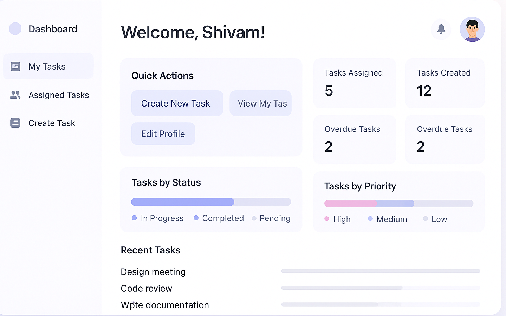

# 📋 Task Management System

<div align="center">
  
  
  
  
  
  
</div>

<p align="center">
  A modern, comprehensive task management system with user authentication, real-time notifications, team collaboration, and powerful task organization capabilities.
</p>

<div align="center">
  
</div>

## ✨ Features

### 🔐 User Management

- **Secure Authentication**: Email & password login with JWT tokens
- **User Profiles**: Customizable user profiles with roles and preferences
- **Role-Based Access Control**: Admin, Manager, and User permission levels
- **Account Management**: Password reset, email updates, and profile customization

### 📝 Task Organization

- **Comprehensive Task Creation**: Title, description, priority levels, due dates, and categories
- **Advanced Filtering**: Search tasks by any criteria including assignee, status, or due date
- **Task Statuses**: Track progress with To Do, In Progress, Under Review, and Completed statuses
- **Priority Levels**: Organize tasks by Low, Medium, High, and Urgent priorities

### 👥 Team Collaboration

- **Task Assignment**: Assign tasks to team members with notification alerts
- **Task Comments**: Discuss tasks directly with contextual comments
- **Team Visibility**: Share tasks and organize team workload efficiently
- **Delegation Controls**: Transfer ownership and responsibility of tasks

### 📊 Analytics & Reporting

- **Task Completion Metrics**: Track completion rates and productivity
- **Time Analysis**: Visualize task duration and team efficiency
- **User Performance**: Review individual and team performance statistics
- **Custom Reporting**: Generate reports based on various task parameters

### 🔔 Real-Time Features

- **Live Notifications**: Instant updates for task assignments and mentions
- **Activity Feed**: Chronological log of all task-related activities
- **Status Updates**: Real-time status changes visible to all team members
- **Due Date Alerts**: Automatic reminders for approaching deadlines

### 🔄 Advanced Features

- **Recurring Tasks**: Schedule repeating tasks (daily, weekly, monthly)
- **Offline Support**: Continue working without internet connection (PWA)
- **Dark/Light Mode**: Choose your preferred visual theme
- **Mobile Responsive**: Full functionality on all device sizes

## 🛠️ Technology Stack

### Backend Architecture

- **Runtime**: Node.js with Express.js for API development
- **Database**: MongoDB with Mongoose ODM for data modeling
- **Authentication**: JWT (JSON Web Tokens) with HTTP-only cookies
- **Real-time**: Socket.IO for live notifications and updates
- **Security**: bcrypt for password hashing, Helmet.js for HTTP security

### Frontend Framework

- **Framework**: Next.js 13+ with App Router and Server Components
- **Language**: TypeScript for type safety and developer experience
- **State Management**: Zustand for global state with React Query for data fetching
- **Styling**: TailwindCSS for responsive design and theming
- **Forms**: React Hook Form with Zod validation

### DevOps & Deployment

- **CI/CD**: GitHub Actions for continuous integration
- **Deployment**: Vercel (frontend) and Render (backend)
- **Testing**: Jest and React Testing Library
- **Monitoring**: Sentry for error tracking

## 📦 Project Structure

```
task-management/
├── backend/                # Express.js API server
│   ├── src/
│   │   ├── config/         # Environment configuration
│   │   ├── controllers/    # API route handlers
│   │   ├── middleware/     # Custom middleware functions
│   │   ├── models/         # MongoDB schema models
│   │   ├── routes/         # API endpoint definitions
│   │   ├── services/       # Business logic services
│   │   ├── utils/          # Helper utilities
│   │   ├── sockets/        # Real-time socket handlers
│   │   └── server.js       # Application entry point
│   ├── tests/              # Backend test suites
│   └── package.json        # Backend dependencies
│
└── frontend/               # Next.js web application
    ├── src/
    │   ├── app/            # Next.js App Router pages
    │   ├── components/     # Reusable UI components
    │   ├── hooks/          # Custom React hooks
    │   ├── providers/      # Context providers
    │   ├── services/       # API client services
    │   ├── stores/         # Zustand state stores
    │   ├── types/          # TypeScript type definitions
    │   └── utils/          # Frontend utilities
    ├── public/             # Static assets
    ├── styles/             # Global CSS and themes
    └── package.json        # Frontend dependencies
```

## 🚀 Getting Started

### Prerequisites

- Node.js 16.x or higher
- MongoDB 4.4 or higher
- npm or yarn package manager

### Backend Setup

1. **Clone the repository**

   ```bash
   git clone https://github.com/yourusername/task-management.git
   cd task-management
   ```

2. **Install backend dependencies**

   ```bash
   cd backend
   npm install
   ```

3. **Configure environment variables**

   Create a `.env` file in the backend directory:

   ```
   PORT=5000
   NODE_ENV=development
   MONGODB_URI=mongodb://localhost:27017/task-management
   JWT_SECRET=your_jwt_secret_key
   JWT_EXPIRES_IN=7d
   COOKIE_EXPIRES_IN=7
   ```

4. **Start the development server**
   ```bash
   npm run dev
   ```
   The API server will be available at http://localhost:5000

### Frontend Setup

1. **Install frontend dependencies**

   ```bash
   cd frontend
   npm install
   ```

2. **Configure environment variables**

   Create a `.env.local` file in the frontend directory:

   ```
   NEXT_PUBLIC_API_URL=http://localhost:5000/api
   ```

3. **Start the Next.js development server**
   ```bash
   npm run dev
   ```
   The web application will be available at http://localhost:3000

## 💻 Development Workflow

### Code Standards

- **Linting**: ESLint configured for TypeScript
- **Formatting**: Prettier for consistent code style
- **Commit Messages**: Follow conventional commit format
- **Branch Strategy**: Feature branches with pull requests to main

### Testing

Run backend tests:

```bash
cd backend
npm test
```

Run frontend tests:

```bash
cd frontend
npm test
```

### Building for Production

Backend build:

```bash
cd backend
npm run build
```

Frontend build:

```bash
cd frontend
npm run build
```

## 🌐 Deployment

### Backend Deployment (Render)

1. Create a new Web Service on Render
2. Connect to your GitHub repository
3. Set build command: `cd backend && npm install && npm run build`
4. Set start command: `cd backend && npm start`
5. Add environment variables as configured in `.env`

### Frontend Deployment (Vercel)

1. Import your repository to Vercel
2. Set the root directory to `frontend`
3. Vercel will automatically detect Next.js and configure the build
4. Add environment variables as needed

## 👥 User Roles and Permissions

### Admin

- Complete system access
- Manage users and roles
- Access analytics and reports
- Configure system settings

### Manager

- Create and manage projects
- Assign tasks to team members
- View team analytics
- Generate reports

### User

- View assigned tasks
- Create personal tasks
- Update task status
- Communicate on task threads

## 🧰 Administrator Setup

The application requires at least one administrator account. Here are the options to create the initial admin:

### Option 1: Admin Seeding Script

```bash
cd backend
npm run seed:admin
```

This creates an admin with these default credentials:

- Email: admin@example.com
- Password: adminPassword123!
- Name: Admin User

### Option 2: First-User-Admin Mode

Add to your backend `.env` file:

```
FIRST_USER_ADMIN=true
```

The first registered user will automatically receive admin privileges.

### Option 3: Manual Database Update

```javascript
// Using MongoDB shell
db.users.updateOne({ email: "user@example.com" }, { $set: { role: "admin" } });
```

## 📱 Mobile and PWA Support

The application works as a Progressive Web App (PWA) with:

- Offline capabilities
- Home screen installation
- Push notifications
- Responsive design for all device sizes

## 🤝 Contributing

Contributions are welcome! Please feel free to submit a Pull Request.

1. Fork the repository
2. Create your feature branch (`git checkout -b feature/amazing-feature`)
3. Commit your changes (`git commit -m 'Add some amazing feature'`)
4. Push to the branch (`git push origin feature/amazing-feature`)
5. Open a Pull Request

## 📄 License

This project is licensed under the MIT License - see the [LICENSE](LICENSE) file for details.

## 📬 Contact

Project Live Link: [https://task3-six-iota.vercel.app]

---

<div align="center">
  <p>Built with ❤️ by Your Team</p>
</div>
